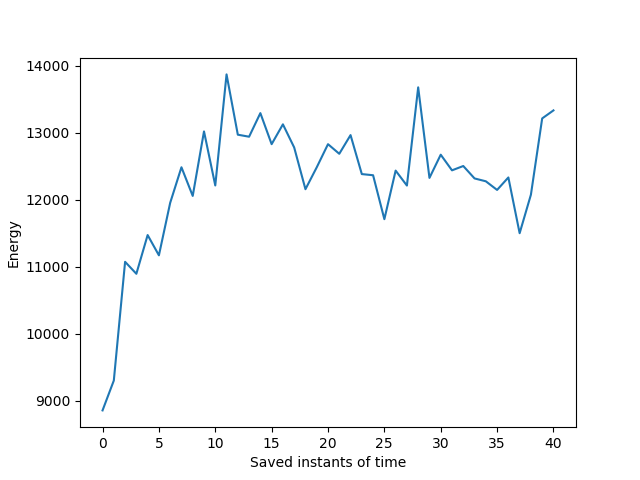
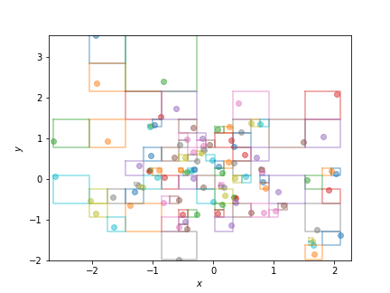
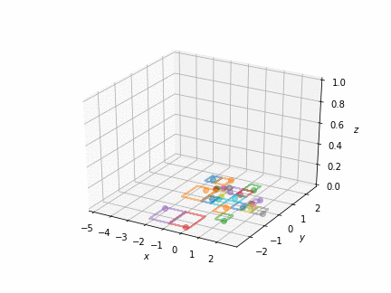

########
Examples
########

.. toctree::
    :maxdepth: 2

Energy measurment
*****************

.. literalinclude:: astrohut/examples/energy.py

2d examples
***********

random2d
========

.. literalinclude:: astrohut/examples/random2d.py

3d examples
***********

random3d
========
.. figure:: astrohut/examples/random3d.gif
   :scale: 75 %
   :align: center

.. literalinclude:: astrohut/examples/random3d.py

disk3d
========

.. literalinclude:: astrohut/examples/disk3d.py

collision3d
===========
.. figure:: astrohut/examples/collision3d.gif
   :scale: 75 %
   :align: center

.. literalinclude:: astrohut/examples/collision3d.py
