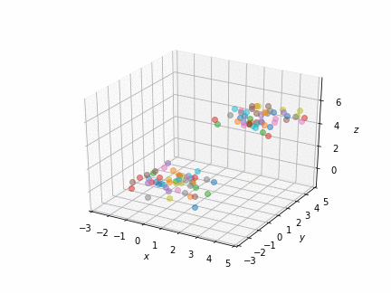

.. astrohut documentation master file, created by
   sphinx-quickstart on Tue Aug  1 05:52:50 2017.
   You can adapt this file completely to your liking, but it should at least
   contain the root `toctree` directive.

Welcome to astrohut!
======================================
astrohut is a NBody gravity simulator that aims to help students understand many body systems,
as well as motivating the use of computational tools to solve physical problems.
Written in Python, with the core functions in C, astrohut depends on the following libraries:

* `NumPy`_
* `Matplotlib`_

.. _NumPy: http://www.numpy.org/
.. _Matplotlib: http://matplotlib.org/

.. toctree::
   :maxdepth: 2
   :caption: Contents:

   self

Installing
----------
astrohut is freely available on PyPI, thus can be easily installed with pip:

``pip install astrohut``

The development version is hosted on `GitHub <http://github.com/jsbarbosa/astrohut>`_, and can be installed by running the `setup.py`.

``python setup.py install``

Documentation
=============
astrohut is divided in five scripts: `core/constants.py`, `core/core.py`, `core/interface.py`, `core/structs2d.py`.
They contain the definition of the `Simulation` class, as well as the structures `body2d`, `node2d`, `point2d`.

Root class is `Simulation` which defines the system in which the simulation will take place.

.. toctree::
    :maxdepth: 2

    documentation

Examples
========
.. image:: astrohut/examples/random2d.gif
   :width: 45%

.. toctree::
    :maxdepth: 2

    examples

Indices and tables
==================

* :ref:`genindex`
* :ref:`modindex`
* :ref:`search`
